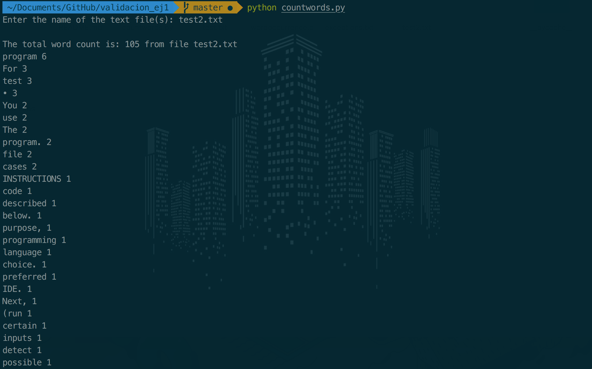

#  Software Verification and Validation

- Student: __Ricardo Mirón Torres__ (r.miron@alumnos.upm.es)
- Master Universitario en Software y Sistemas (MUSS)
- Universidad Politécnica de Madrid (ETSII)

## Specification

The program has to read a text from one or several files. The names will be provided as
an input to the program. For each file provided, the program has to show: the frequency
of appearance of each word it contains, excepting: articles, prepositions and pronouns,
which will not be taken into consideration.

## Material to be delivered
### 1. Source code

The program is written in Python 3 programing language. In which the main function takes the name(s) of the text file(s), in case of being multiple, separated by spaces and iterates over each file and prints the output by order of more appearances of each one of the files entered.

```
#import the Counter module
from collections import Counter

def main():

    #user inputs file names separated by spaces
    file = input('Enter the name of the text file(s): ')
    files = file.split(" ")

    #read the file with the words we want to exclude and make a list
    with open(r'exceptions.txt') as e:
        exceptions = [exception for line in e for exception in line.split()]

    #iterate over each file name
    for y in files:

        with open(y) as f:

            words = [word for line in f for word in line.split()]
            #ignore the intersection between the current list and the excpetions list
            words = [x for x in words if x not in exceptions]
            print("\nThe total word count is:", len(words), "from file", y)

            c = Counter(words)
            #show the list of words by the frequency of appearance
            for word, count in c.most_common():
                print(word, count)
main()
```
For the exceptions, a text file (*exceptions.txt*) with a list of "stop words" is used, including: articles, prepositions, pronouns and other most common used words in the english language. ([full list](http://ir.dcs.gla.ac.uk/resources/linguistic_utils/stop_words))

### 2. Test cases

The cases (3) used to test the program include 2 text files with different length, complexity and format. Additionally a third test case was the input of both text files to be runned at the same time.

__2.1 Case 1__

First text file is an extract of an online news article without any format. ([source](https://www.bbc.com/news/science-environment-45653099))

```
It is likely to be the most critical and controversial report on climate change in recent years.

Leading scientists are meeting in South Korea this week to see if global temperatures can be kept from rising by more than 1.5C this century.

The world has already passed one degree of warming as carbon emissions have ballooned since the 1850s.

Many low-lying countries say they may disappear under the sea if the 1.5C limit is breached.

After a week of deliberations in the city of Incheon, the researchers' new report is likely to say that keeping below this limit will require urgent and dramatic action from governments and individuals alike.

One scientist told BBC News that our lives would never be the same if the world changed course to stay under 1.5C.

he new study is being produced by the Intergovernmental Panel on Climate Change (IPCC), a body set up to provide a clear scientific view for governments on the causes, impacts and solutions to rising temperatures.

When the Paris climate agreement was signed in December 2015, there was delight and surprise among many delegates that countries had agreed that the long-term goal of the pact should be to keep global temperatures "well below two degrees C above pre-industrial levels and to pursue efforts to limit the temperature increase even further to 1.5 degrees C".

To examine the challenges and impacts of keeping temperatures below the 1.5C limit, the UN asked the IPCC to produce a special report, which the scientific body has delivered in record time.

This week in Incheon, the scientists and government delegates will go through the final, short, 15-page Summary for Policymakers, the key distillation of the underlying scientific reports.

This will be done word by word, to ensure everyone - scientists and governments alike - are in agreement on the text.
```

Results 1:

The first case returns correctly a list in which the most common words are listed.


_note: some of the noticed errors are that lower and upper case letters are taken as different words, some special characters are not filtered._

__2.2 Case 2__

Second text file is a copy of this assignment instruction with a more complex format.

```
INSTRUCTIONS
You have to code the program described below. For that purpose, you can use the
programming language of your choice. You can use your preferred IDE.
Next, you have to test the program (run certain inputs on the program to detect possible
faults).
Deadline: October 4, 15:00h. Submission through Moodle (email if you do not have
access yet).
SPECIFICATION
The program has to read a text from one or several files. The names will be provided as
an input to the program. For each file provided, the program has to show: the frequency
of appearance of each word it contains, excepting: articles, prepositions and pronouns,
which will not be taken into consideration.
MATERIAL TO BE DELIVERED
• Source code.
• Test cases used to test the program (all information you think is relevant),
including results of running them.
• Strategy followed to select which test cases should be run on the program. For
example, in the case of the calculator: “division of odd numbers”, etc.
A single pdf file (self-contained) must be uploaded to Moodle.
```
Results 2:

The second case also returns correctly a list in which the most common words are listed.


_note: some additional noticed errors besides the ones in the last case are the words that are contained in quotes, parenthesis or that end with a semicolon are also considered as separate words._

__2.3 Case 3__

Third case is the previous two text file tested at the same time as a single input.


Results 3:

The third case also returns the exact same result as previous ones but in a continuous print in which each text file is separated by a break line.


### 3. Strategy followed

For validations tests, the strategy was to test the main function by each of its logical procedures with different scenarios where we might have errors.

__3.1 User input__

Code:
```
#user inputs file names separated by spaces
file = input('Enter the name of the text file(s): ')
files = file.split(" ")
```
We get an error, as expected by purposely entering:

- unsupported characters or operations.
- multiple names for files that are not separated by spaces. Which is in itself an error the next procedure, but caused by the *split* funtion not parsing anything besides spaces.

Screenshots:


__3.2 Reading the text file__

Code:
```
with open(y) as f:

    words = [word for line in f for word in line.split()]
    #ignore the intersection between the current list and the excpetions list
    words = [x for x in words if x not in exceptions]
    print("\nThe total word count is:", len(words), "from file", y)
```

We get an error, as expected by trying to read:
- file names that does not exist in the current directory.
- files that are not simple text files (like Word documents or PDFs).

Screenshots:


__3.3 Counting words and printing the result__

Code:
```
c = Counter(words)
#show the list of words by the frequency of appearance
for word, count in c.most_common():
    print(word, count)
```

This function counts the number of times an item on the list appears and prints that list putting the most frequent ones on top followed by the number of times it appears in the list. Per se, there was no problem detected directly in how the code works but as exposed in the test cases, some characters affect the way the program separates "unique" words.

__3.4 Pytest__

The [pytest](https://docs.pytest.org/en/latest/) framework allows you to run small tests of Python code, and can be scaled to more complex functional testing also.

Running the most simple test returns 1 detected error. A quick google search suggest that since ```input()``` is an interactive function, we'll want to mock out the return value in our automated tests. ([source](http://mcs.une.edu.au/doc/python3-pytest/html/en/capture.html))


